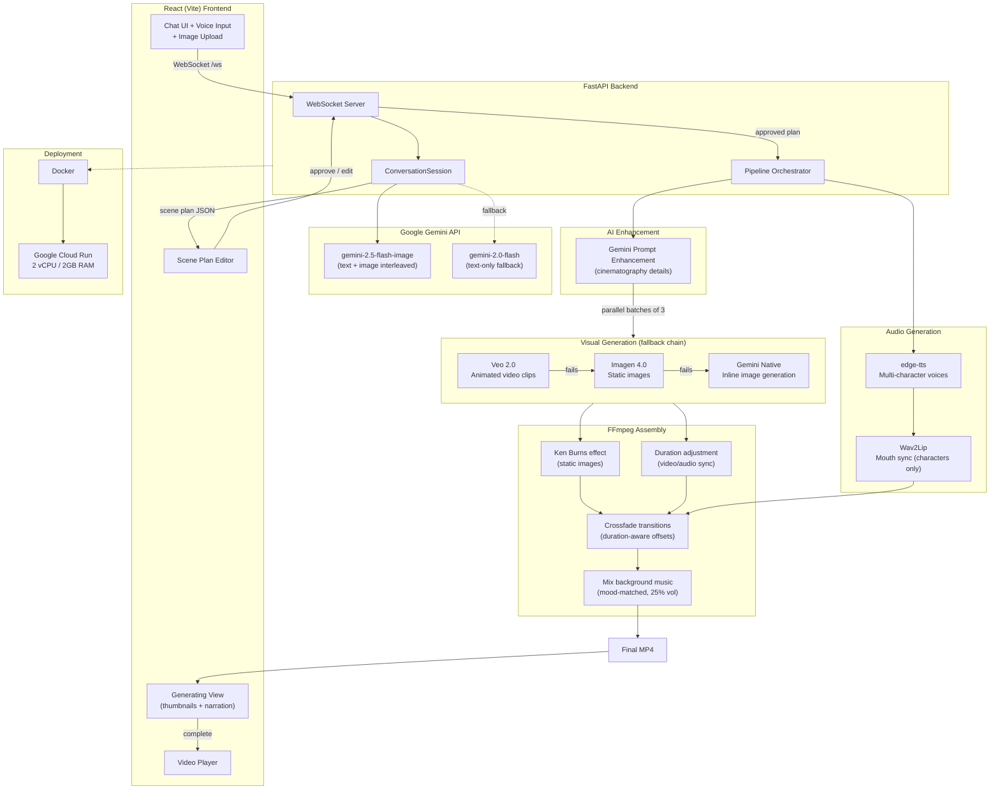

# CutTo

[](https://github.com/LakshmiSravyaVedantham/cutto/actions/workflows/ci.yml)

**AI Video Director for Kids' Education** -- describe any lesson in a conversation, get a finished animated video with AI-generated visuals, multi-character voiceover, lipsync, and background music. Turn lesson ideas into videos kids love to watch.

Built for the [Google Gemini Live Agent Challenge](https://ai.google.dev/gemini-api/docs/live-agent-challenge) (Creative Storyteller category).

**The problem:** Educational content creators and teachers need animated videos but can't afford animators, voiceover artists, or video editors. A single 90-second explainer takes 4-8 hours to produce or $200+ to outsource.

**The solution:** Describe a lesson -- "explain how volcanoes erupt for 8-year-olds" -- and CutTo writes the script, generates animated visuals, adds voiceover with lipsync, and delivers a finished MP4 ready to upload.

---

## How It Works

1. **Conversation** -- Describe your lesson idea via text or voice. The AI creative director shapes it into a video concept with enthusiasm: *"I'm seeing this as a journey inside the earth — layers peeling away, magma rising..."*
2. **Scene Plan** -- Gemini generates a scene-by-scene plan with inline preview images. Each scene has narration text, a visual prompt, and a speaker assignment (narrator, character 1, or character 2).
3. **Edit** -- Review the plan in an interactive editor. Change narration, visuals, speakers. Add or remove scenes. Ask the AI for revisions.
4. **Generate** -- Approve the plan. The pipeline runs: Veo 2.0 generates animated clips, edge-tts produces voiceover with distinct voices per character, Wav2Lip applies lipsync to dialogue close-ups, and FFmpeg assembles everything with mood-matched background music.
5. **Watch & Download** -- The finished MP4 plays in-browser. Download it or start over.

---

## Architecture



**Pipeline detail per scene:**

1. **AI prompt enhancement**: Gemini expands the visual prompt with cinematography details (camera motion, lighting, color palette, depth of field)
2. **Visual generation**: Veo 2.0 animated clip -> Imagen 4.0 static image -> Gemini native image (3-level fallback chain with retries)
3. **TTS voiceover** with speaker-specific voice (runs in parallel with visual generation)
4. If static image: **Ken Burns zoom** effect to create motion. If Veo video: **duration adjustment** to match audio.
5. **Wav2Lip lipsync** applied to character dialogue scenes (skipped for narrator wide shots)
6. Visual + audio combined into scene clip, **JPEG thumbnail** extracted for real-time preview
7. All scene clips joined with **crossfade transitions** (duration-aware xfade offsets), background music mixed at 25% volume

Scenes are processed in **parallel batches of 3** to balance speed against Veo rate limits.

---

## Tech Stack

| Layer | Technology | Purpose |
|---|---|---|
| Frontend | React 18, Vite 5 | Single-page app with WebSocket communication |
| Backend | Python 3.11, FastAPI | WebSocket server, API routing, pipeline orchestration |
| AI Conversation | Gemini (google-genai SDK + ADK) | Creative direction, scene planning, interleaved text + image output |
| Video Generation | Veo 2.0 | Animated video clips from text prompts |
| Image Generation | Imagen 4.0 | Static scene images (fallback when Veo is unavailable) |
| Voice Synthesis | Google Cloud TTS + edge-tts | Multi-character voiceover with WaveNet voices (edge-tts fallback) |
| Lipsync | Wav2Lip | Mouth sync for character dialogue close-ups |
| Video Processing | FFmpeg | Ken Burns effect, clip assembly, music mixing |
| Voice Input | Web Speech API | Browser-native speech recognition |
| Deployment | Docker, Google Cloud Run | Containerized deployment with deploy script |

---

## Features

- **Conversational scene planning** with Gemini producing interleaved text and images
- **Voice input** via Web Speech API -- speak your video idea instead of typing
- **Reference image upload** -- upload a photo, sketch, or mood board and Gemini analyzes the visual style, color palette, and composition to generate a matching `visual_style_anchor`
- **Quick-start templates** -- one-click demo prompts for kids' content (heart explainer, solar system adventure, volcano science) that auto-connect and generate
- **AI prompt enhancement** -- Gemini expands every visual prompt with cinematography details (camera motion, lighting, color palette, depth of field) before sending to Veo
- **3 distinct voice tracks**: narrator (en-US-GuyNeural), character 1 (en-US-JennyNeural), character 2 (en-US-ChristopherNeural)
- **Scene plan editor**: edit narration, visual prompts, and speaker assignments per scene; add, remove, or reorder scenes; ask the AI for revisions in natural language
- **Visual generation fallback chain**: Veo 2.0 -> Imagen 4.0 -> Gemini native image (with automatic retries)
- **Visual consistency via style anchor**: All scenes in a video share the same visual_style_anchor for consistent character design and style
- **Veo prompt optimization**: Follows Google's official best practices — motion-focused, specific camera terms, no quotation marks
- **Wav2Lip lipsync** automatically applied to character dialogue scenes with visible faces
- **Ken Burns effect** on static images to create camera movement
- **Crossfade transitions** between scenes with duration-aware xfade offsets
- **Parallel scene processing** in batches of 3 for faster generation
- **Scene preview thumbnails** -- see JPEG thumbnails of completed scenes during generation
- **Scene narration preview** -- see what each scene says alongside its status during generation
- **5 mood-matched background music tracks**: dramatic, upbeat, calm, inspiring, playful
- **Real-time progress tracking** via WebSocket -- see each scene's status as it generates
- **Rate limiting**: 3 videos per IP per hour
- **Demo password gate** (optional DEMO_SECRET env var)
- **6 video categories**: Story, Explainer, Documentary, Tutorial, Marketing, Motivational
- **Strong creative director persona**: the AI has opinions about filmmaking, suggests bold creative choices
- **Multi-agent ADK architecture**: Director, Storyboard, and Orchestrator agents with specialized roles
- **Graceful error handling**: failed scenes show visual indicator, pipeline continues with remaining scenes
- **Exponential backoff reconnection**: WebSocket auto-reconnects with 1s->30s delay
- **Mobile responsive**: touch-friendly buttons, stacking cards, compact layout
- **REST API for judges**: `/api/plan` for direct plan generation, `/api/agent` for ADK architecture introspection
- **119 automated tests** covering pipeline, FFmpeg, models, agent, TTS, Veo, Imagen, API, and ADK agents

---

## Hackathon Compliance

> Gemini Live Agent Challenge -- Creative Storyteller category

| Requirement | Implementation |
|---|---|
| **Gemini model** | Gemini drives the entire conversation, generates the scene plan, and produces inline preview images during planning |
| **Google GenAI SDK + ADK** | All Gemini/Imagen/Veo calls use `google-genai`; ADK multi-agent architecture in `adk_agent.py` (director + storyboard + orchestrator) with 4 function tools |
| **Google Cloud service** | Veo 2.0 (video gen), Imagen 4.0 (image gen), Cloud TTS (WaveNet voices), Cloud Storage (video persistence), Cloud Run (hosting) |
| **Interleaved output** (Creative Storyteller mandatory) | Gemini generates text + images inline during scene planning using `response_modalities=["TEXT", "IMAGE"]` |
| **Live agent interaction** | Real-time WebSocket conversation with Gemini, voice input via Web Speech API |
| **Automated cloud deployment** (bonus) | `deploy.sh` — one-command deploy to Cloud Run |

---

## Quick Start

### Prerequisites

- Python 3.11+
- Node.js 18+
- FFmpeg installed and on PATH
- A [Google AI Studio](https://aistudio.google.com/) API key with access to Gemini, Veo, and Imagen

### 1. Clone and set up

```bash
git clone https://github.com/LakshmiSravyaVedantham/cutto.git
cd cutto
```

### 2. Backend

```bash
python -m venv venv
source venv/bin/activate
pip install -r backend/requirements.txt
```

### 3. Frontend

```bash
cd frontend
npm install
npm run build
cd ..

# Copy build output to where the backend serves it
rm -rf static
cp -r frontend/dist static
```

### 4. Environment

```bash
cp .env.example .env
```

Edit `.env` and set your API key:

```
GOOGLE_API_KEY=your-google-ai-studio-api-key
```

### 5. Run

```bash
uvicorn backend.main:app --reload --port 8000
```

Open `http://localhost:8000` in your browser.

**API docs**: FastAPI auto-generates interactive API documentation at `http://localhost:8000/docs` — browse all REST endpoints, try them out, and inspect request/response schemas.

**Judge-friendly endpoints** (try these with curl):

```bash
# Inspect the 3-agent ADK architecture
curl http://localhost:8000/api/agent | python3 -m json.tool

# Generate a scene plan (no WebSocket needed)
curl -X POST http://localhost:8000/api/plan \
  -H "Content-Type: application/json" \
  -d '{"description": "Explain how photosynthesis works for 8-year-olds"}'

# List all video categories
curl http://localhost:8000/api/categories

# View models, features, and limits
curl http://localhost:8000/api/config

# Health check
curl http://localhost:8000/health
```

---

## Environment Variables

| Variable | Default | Description |
|---|---|---|
| `GOOGLE_API_KEY` | (required) | Google AI Studio API key |
| `GCS_BUCKET` | (empty) | Optional GCS bucket for video persistence |
| `GEMINI_MODEL` | `gemini-2.0-flash` | Model for text-only fallback conversations |
| `GEMINI_IMAGE_MODEL` | `gemini-2.5-flash-image` | Model for interleaved text + image generation |
| `IMAGEN_MODEL` | `imagen-4.0-generate-001` | Imagen model for static image fallback |
| `VEO_MODEL` | `veo-2.0-generate-001` | Veo model for animated video generation |
| `MUSIC_DIR` | `./music` | Path to directory containing background music files |
| `DEMO_SECRET` | (empty) | Optional password gate for demo deployments |

---

## Project Structure

```
cutto/
  backend/
    main.py              # FastAPI app, WebSocket endpoint, rate limiting
    agent.py             # Gemini conversation session, scene plan extraction
    adk_agent.py         # Google ADK multi-agent (director + storyboard + orchestrator)
    pipeline.py          # Video generation pipeline orchestrator
    models.py            # Pydantic models (Scene, ScenePlan, PipelineProgress)
    config.py            # Environment variable loading
    services/
      veo.py             # Veo 2.0 video generation with polling
      imagen.py          # Imagen 4.0 image generation
      tts.py             # Google Cloud TTS + edge-tts multi-voice synthesis
      ffmpeg.py          # FFmpeg operations (Ken Burns, concat, music mixing, audio adjust)
      lipsync.py         # Wav2Lip integration
      storage.py         # Optional Google Cloud Storage for video persistence
  frontend/
    src/
      App.jsx            # Landing page and view routing
      hooks/
        useWebSocket.js  # WebSocket connection and state management
      components/
        ConversationView.jsx   # Chat UI with voice input
        ScenePlanEditor.jsx    # Interactive scene plan editing
        GeneratingView.jsx     # Real-time pipeline progress
        DoneView.jsx           # Video player and download
  music/
    dramatic.mp3         # Background music tracks (one per mood)
    upbeat.mp3
    calm.mp3
    inspiring.mp3
    playful.mp3
  tests/
    test_adk.py
    test_agent.py
    test_api.py
    test_ffmpeg.py
    test_imagen.py
    test_models.py
    test_pipeline.py
    test_tts.py
    test_veo.py
  wav2lip_repo/          # Wav2Lip model (git-ignored, optional)
  .github/workflows/
    ci.yml               # GitHub Actions CI (test + lint + frontend build)
    deploy.yml           # Auto-deploy to Cloud Run on push to main
  Dockerfile             # Multi-stage build (Node 18 + Python 3.11-slim + FFmpeg)
  .dockerignore          # Keeps Docker context lean
  deploy.sh              # One-command deploy to Google Cloud Run
  .env.example
```

---

## Deployment

### Google Cloud Run

```bash
# Set your GCP project and API key
export GOOGLE_API_KEY=your-key
./deploy.sh your-gcp-project-id
```

The deploy script builds the frontend, copies it to `static/`, builds a Docker container, and deploys to Cloud Run with 4 vCPUs, 4GB RAM, session affinity, and 15-minute timeout per request.

### Docker (local)

```bash
# Build frontend first
cd frontend && npm run build && cd ..
rm -rf static && cp -r frontend/dist static

# Build and run
docker build -t cutto .
docker run -p 8080:8080 -e GOOGLE_API_KEY=your-key cutto
```

---

## Wav2Lip Setup (Optional)

Lipsync is optional. Without it, character dialogue scenes play the video as-is without mouth sync. To enable:

1. Clone Wav2Lip into the project root:
   ```bash
   git clone https://github.com/Rudrabha/Wav2Lip.git wav2lip_repo
   ```
2. Download the `wav2lip_gan.pth` checkpoint and place it at `wav2lip_repo/checkpoints/wav2lip_gan.pth`
3. The pipeline auto-detects the checkpoint and applies lipsync to character dialogue scenes

---

## Tests

```bash
pytest tests/ -v
```

119 tests covering FFmpeg command building, pipeline orchestration, agent MIME detection/plan extraction, Imagen/Veo service interfaces, Pydantic model validation, API endpoints (including rate limiting), ADK agent architecture, and TTS voice mapping.

---

## License

MIT
